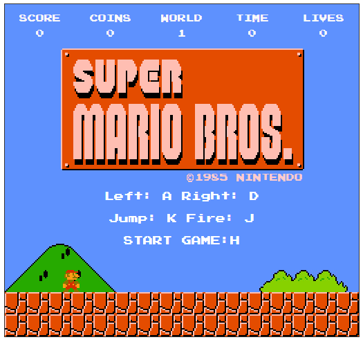
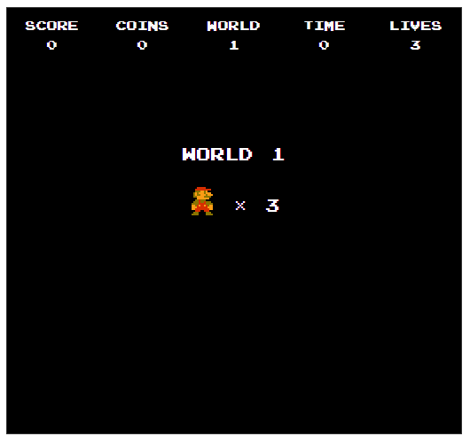
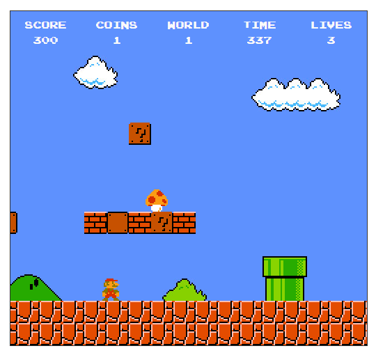
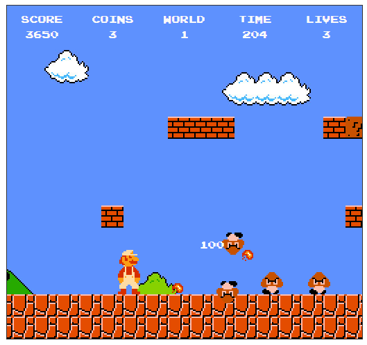
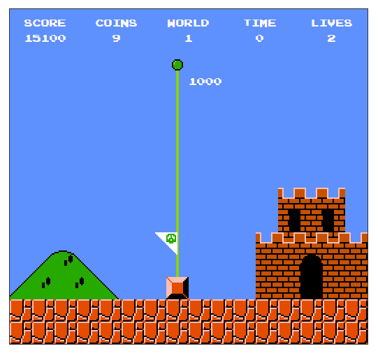

## 游戲介紹

通過 A D 鍵來控制角色左右移動，K鍵跳，吃到子彈時使用J鍵射擊，按H鍵開始游戲。游戲還是以背景運動的方式來實現人物向前跑的效果。其中主要運用了碰撞檢測、拋物線運動等演算法，並對大量的數據進行了分組處理。是否真實還原了游戲，由你來體驗並給出答案。 當然，游戲中有些地方在操作控制上稍微有些不足，有待進一步完善。目前只有一關。

## 主要功能

- **游戲地圖的創建**： 地圖的樣式展現，陸地，石頭，管道，岩石，帶屬性硬石，碉堡，城堡岩，旗幟，旗桿等。

- **游戲關卡的設置**：障礙物、瑪麗奧、敵人、隱藏物等位置屬性。

- **瑪麗奧的功能設置**：實現定位、緩動效果移動、跳躍、成長、降級、發射子彈、死亡和障礙物及敵人碰撞檢測。

- **敵人的功能設置**：實現定位、移動、死亡、飛分數和障礙物及瑪麗奧碰撞檢測。

- **障礙物的設置**：實現定位、實現碎石、飛金幣、長蘑菇、飛分數、移動等效果、隱藏物的展現和瑪麗奧的碰撞檢測。

- **屬性物的設置**：子彈，成長蘑菇，加人蘑菇，子彈花，金幣的屬性設置及功能實現。

- **游戲數據的展示**：游戲開始、開始關卡、游戲結束界面數據展示，游戲進行中展現倒計時、分數、金幣、關卡、生命等數據。
